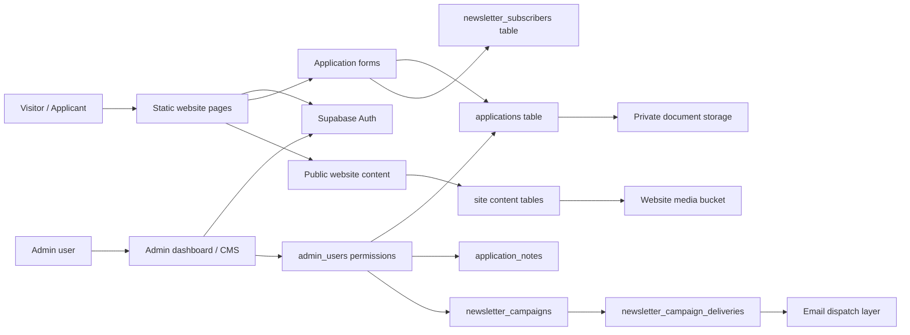
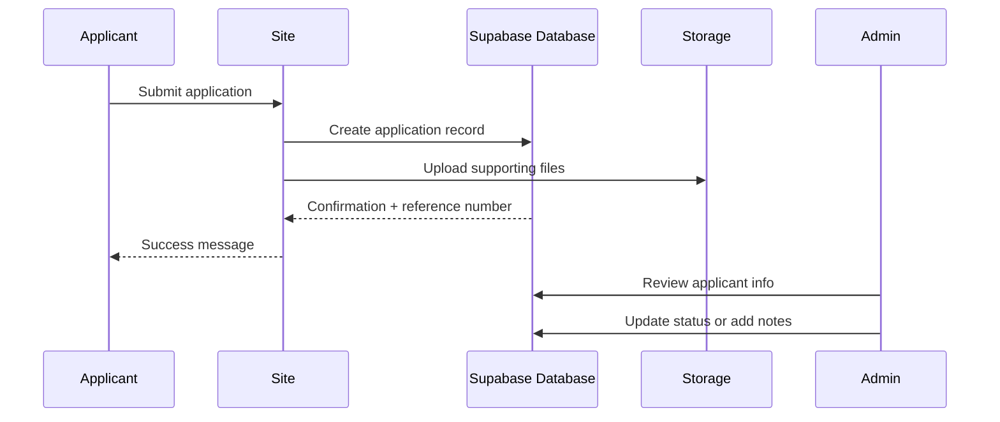

# Lawrence: Project Design Summary

## Executive summary

This project combines a lightweight static website with a managed Supabase data platform. The front end is fast and easy to deploy, while the back end manages applicant records, admin workflows, private file storage, and audience-based newsletters.

In simple terms, the design separates:

- public website content for visitors
- private admissions records for applicants
- admin-only workflows for review and approval
- campaign and email targeting logic for outreach
- document and media storage in dedicated buckets

This gives the school a cost-effective and manageable system without building a large custom application server.

## Why this design works

The design is intentionally modular and practical:

- Static pages keep the site fast, readable, and cheap to host.
- Supabase handles authentication, storage, and database logic in a managed environment.
- Postgres tables enforce structure around admissions, newsletters, and admin access.
- RLS and role checks protect private actions instead of relying only on the browser UX.
- Database functions centralize complex logic such as campaign targeting and delivery preparation.

## High-level system view

## Core building blocks

### 1. Website layer

The public site is composed of static HTML, CSS, and JavaScript pages such as the home page, admissions page, news page, leadership information, and admin screens.

This keeps deployment predictable and fast, while allowing content and campaign updates to happen without a heavy application stack.

### 2. Identity and access layer

The project uses Supabase Auth for user sign-in and a dedicated `admin_users` table to identify who is allowed to work in the admin area.

This is the right pattern for a school environment because it keeps:

- public users separated from admin users
- private application data out of public browser access
- admin access auditable in one place

Important note: the UI check is helpful, but the real protection must exist in database rules and server-side logic.

### 3. Applicant management

Applicant records are stored in the `applications` table. The schema includes:

- unique reference numbers
- program type tracking
- applicant status values
- form data payloads
- supporting notes
- email verification fields
- submission timestamps

This makes the admissions workflow easier to review and report on without overloading the front end.

### 4. Newsletter and audience logic

The newsletter component is designed to handle both subscribers and applicants with filters for:

- audience type
- interest area
- applicant status

This is implemented centrally in a database function so the selection logic is consistent and not spread across multiple client-side scripts.

## How the application flow works

Typical flow:

1. A visitor submits an application.
2. A record is created with a unique reference number.
3. Supporting documents are stored in a private bucket, not embedded in the record.
4. Admin staff review the application and adjust its status.
5. The applicant receives confirmation or follow-up communication based on the workflow.

## Why email verification is important

The design includes fields for:

- verification tokens
- expiry timestamps
- verification status
- unique hash storage instead of raw tokens

This is a strong design choice because it reduces risk of:

- fake or invalid addresses
- sending campaigns to unverified applicants
- stale verification links being reused

It is a good operational safeguard for both admissions and communications.

## Risks and what to fix early

### 1. Storage bucket mismatch

Risk:
- an upload fails because the app is configured for a bucket that does not exist in the active project
- the bucket is created in the wrong Supabase project

Impact:
- application files fail to upload
- admin file access breaks
- users lose confidence in the system

Fix:
- keep bucket names and project mapping in a single deployment checklist
- confirm the active project and storage bucket match exactly
- test uploads after every environment change

### 2. Admin authorization drift

Risk:
- the browser hides admin controls, but the database is still permissive
- a user bypasses the UI and tries direct access

Impact:
- unauthorized users can change records
- data integrity is compromised

Fix:
- use `admin_users` as the source of truth
- enforce authorization at the database boundary
- treat the browser check as a convenience layer, not a security control

### 3. Campaign audience errors

Risk:
- a newsletter sends to the wrong audience
- applicant recipients are included when only subscribers were intended

Impact:
- incorrect outreach to parents, applicants, or staff
- low trust and reputational damage

Fix:
- keep audience logic centralized in the database function
- retain strict recipient checks and unique indexes
- test each audience and status combination before launch

### 4. Stale verification tokens

Risk:
- expired or duplicate tokens remain active
- an old link is still accepted after a new verification cycle

Impact:
- confusing applicant experience
- data inconsistency
- campaign targeting based on outdated states

Fix:
- invalidate prior token values when a new verification is created
- clear verification data after success
- periodically remove expired tokens and related pending records

### 5. Orphaned media

Risk:
- a replaced image is left behind
- deleted content still leaves storage objects behind

Impact:
- wasted storage
- cluttered media library
- difficult cleanup later

Fix:
- delete old media when replacing files
- check for references before removing items
- add cleanup jobs for orphaned files

## Operational notes

### Recommended deployment checklist

Before going live, confirm:

- the correct Supabase project is selected
- storage buckets exist and are configured correctly
- RLS policies are live
- admin users are active and valid
- verification flows are tested
- campaign audience rules are validated

### Strong governance practices

- Keep security checks in the database, not only in the browser.
- Use dedicated buckets for private and public media.
- Validate all upload and email workflows before release.
- Keep recovery and deployment notes for the right project and environment.

## Summary

This project is a well-structured, low-complexity platform for a school or institution that needs:

- a public-facing website
- a private applicant system
- a managed admin workflow
- email and campaign targeting
- secure file handling

The core strength of the design is separation of concerns: public content, private admissions, and admin-only operations are kept apart in a way that is easier to maintain and safer to operate.

The biggest operational risks to watch are:

- storage configuration drift
- authorization gaps
- stale verification state
- mis-targeted newsletters
- media cleanup inconsistency

If these are managed early, the system is strong, flexible, and suitable for continuing growth.
