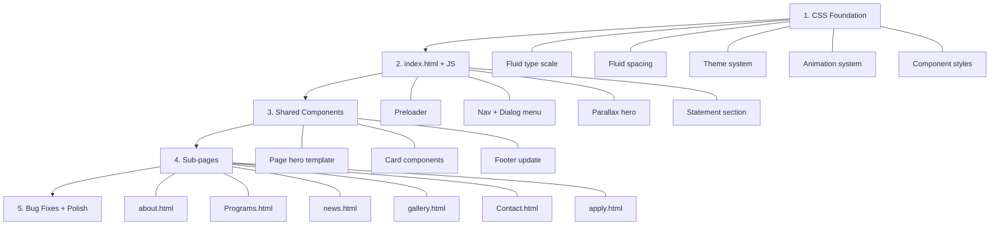

# Korowa → Lawrence: Design Clone Plan

## Overview

Cloning the **Korowa Anglican Girls' School** design language into the existing **Lawrence College & SHS** site. Lawrence keeps its own content, branding, and colors — but adopts Korowa's design patterns, layout architecture, animations, and visual polish.

---

## Korowa Design DNA (What We're Cloning)

| Feature | Korowa Pattern | Lawrence Current |
|---------|---------------|-----------------|
| **Hero** | Full-viewport parallax with layered foreground/background images, animated text reveal ("We don't make ladies — We're too busy making leaders"), scroll-driven overlay | 2-column grid hero with floating cards + count-up stats |
| **Navigation** | Minimal top bar (Logo + "Tour" + "Enquire" + hamburger "Menu"), full-screen dialog overlay with accordion link groups, search, quick links, crest watermark | Pill-shaped nav with all links visible, full-screen mobile overlay |
| **Typography** | Fluid type scale system (`clamp()`-based, ratio-driven from `--type-min-font` to `--type-max-font`), serif display + sans body | Cormorant Garamond headings + Manrope body (good match already) |
| **Animations** | `data-fade` / `data-fade-stagger` system, scroll-driven text gradient fill, parallax via `animation-timeline: view()`, preloader with crest animation | IntersectionObserver `.reveal` system + hero keyframe animations |
| **Cards** | Stacked card sections (`card-stack`), fly-in cards, image hover scale (1.03x), gradient blur overlays | Division cards with gradient top border, hover lift |
| **Buttons** | Layered: invisible link overlay + visible content + animated bg-hover scale, pill-shaped | Standard `.btn-lawrence` with hover lift |
| **Sections** | Theme-aware via CSS custom properties (`--_theme---background`, `--_theme---text`), `data-bg-color` attribute switching | Inline color variables, `--forest-dark` undefined |
| **Footer** | Multi-column with social icons using CSS mask icons, quick links, crest watermark | 4-column Bootstrap grid with contact info |
| **Page Heroes** | Parallax image with scroll-overlay that fades in on scroll, layered depth | Dark gradient overlay on static image |
| **Spacing** | Fluid spacer system (`--_space---1` through `--_space---10` via `clamp()`) | Fixed rem/px spacing |
| **Grid** | Custom column-based grid system with full-width breakout + container columns | Bootstrap 12-column grid |
| **Preloader** | Animated crest logo that scales down + container collapses | None |
| **Dialog Menu** | Native `<dialog>` element with backdrop blur, animated open/close, accordion groups with decorative SVG arrows | `div.mobile-menu` with class toggle |

---

## Files That Need Adjustment

### 🔴 Major Rework (Structure + Style)

#### 1. [`css/style.css`](file:///c:/Users/DANSO%20GODSON/Downloads/GODSON-DONT%20TOUCH/lawrence/css/style.css) — **HEAVIEST CHANGES**
- [ ] Add fluid type scale system (Korowa's ratio-driven `clamp()` approach)
- [ ] Add fluid spacing system (`--_space---` variables)
- [ ] Replace fixed hero layout with full-viewport parallax hero
- [ ] Implement `data-fade` / `data-fade-stagger` animation system (replacing `.reveal`)
- [ ] New button component (layered link + bg-hover scale pattern)
- [ ] New card patterns: stacked cards, fly-in cards, image hover scale
- [ ] Gradient blur overlay component
- [ ] Theme-aware section system (`--_theme---` variables)
- [ ] Native `<dialog>` styling for mobile menu (replace div overlay)
- [ ] Preloader component styles
- [ ] Scroll-driven text gradient fill animation
- [ ] Parallax image system via `animation-timeline: view()`
- [ ] Fix undefined `--forest-dark` / `--forest` variables
- [ ] Add decorative blur circle backgrounds (like Korowa's radial gradient blobs)

#### 2. [`index.html`](file:///c:/Users/DANSO%20GODSON/Downloads/GODSON-DONT%20TOUCH/lawrence/index.html) — **MAJOR REWORK**
- [ ] Add preloader component (animated logo)
- [ ] Restructure nav: minimal top bar → Logo + "Visit Campus" + "Apply Now" + hamburger
- [ ] Replace hero: full-viewport parallax with layered images + animated text
- [ ] Add statement/mission section with scroll-driven text gradient fill
- [ ] Restructure division cards into Korowa's stacked card layout
- [ ] News cards: add image hover scale (1.03x) + gradient blur
- [ ] Restructure CTA banner with Korowa's section theming
- [ ] Add `data-fade` attributes to all reveal elements
- [ ] Switch mobile menu to `<dialog>` with accordion link groups
- [ ] Fix case-inconsistent links (`Programs.html` → `programs.html`)

#### 3. [`js/main.js`](file:///c:/Users/DANSO%20GODSON/Downloads/GODSON-DONT%20TOUCH/lawrence/js/main.js) — **SIGNIFICANT CHANGES**
- [ ] Replace `.reveal` IntersectionObserver with `data-fade` / `data-fade-stagger` animation system
- [ ] Add preloader logic (animate crest, then collapse)
- [ ] Switch mobile menu to `<dialog>` open/close (`.showModal()` / `.close()`)
- [ ] Add scroll-driven parallax initialization
- [ ] Add text gradient fill scroll observer
- [ ] Add accordion navigation toggle logic
- [ ] Keep counter animation (it's good as-is)
- [ ] Add navbar hide/show on scroll direction (Korowa hides nav on scroll down, shows on up)

---

### 🟡 Moderate Changes (Layout + Component Updates)

#### 4. [`about.html`](file:///c:/Users/DANSO%20GODSON/Downloads/GODSON-DONT%20TOUCH/lawrence/about.html)
- [ ] Update nav to match new minimal pattern
- [ ] Replace page hero with parallax image + scroll overlay
- [ ] Apply `data-fade` animation system to all sections
- [ ] Restructure "Our Story" section with Korowa's content layout
- [ ] Update Vision/Mission cards to new card pattern
- [ ] Headmaster quote → styled like Korowa's testimonial (with CSS mask quote marks)
- [ ] Values section → staggered steps layout (`steps-stagger`)
- [ ] Fix CTA section (add `--forest-dark` definition or use theme system)
- [ ] Switch mobile menu to `<dialog>`

#### 5. [`Programs.html`](file:///c:/Users/DANSO%20GODSON/Downloads/GODSON-DONT%20TOUCH/lawrence/Programs.html)
- [ ] Update nav to match new minimal pattern
- [ ] Replace page hero with parallax image + scroll overlay
- [ ] Restructure 6 pathway cards into Korowa's card grid (with image hover scale)
- [ ] Apply `data-fade-stagger` to card grid
- [ ] Remedial detail section → 2-column with parallax image
- [ ] Dr. Berko quote → testimonial component with CSS mask quotes
- [ ] Fix CTA background color
- [ ] Switch mobile menu to `<dialog>`

#### 6. [`news.html`](file:///c:/Users/DANSO%20GODSON/Downloads/GODSON-DONT%20TOUCH/lawrence/news.html)
- [ ] Update nav to match new minimal pattern
- [ ] Replace page hero with parallax hero
- [ ] Featured article → Korowa's card-stack hero pattern (large image + overlay text)
- [ ] News grid cards → add image hover scale (1.03x), gradient blur overlay
- [ ] Apply `data-fade-stagger` to news grid
- [ ] Fix inconsistent footer (align with other pages)
- [ ] Switch mobile menu to `<dialog>`

#### 7. [`gallery.html`](file:///c:/Users/DANSO%20GODSON/Downloads/GODSON-DONT%20TOUCH/lawrence/gallery.html)
- [ ] Update nav to match new minimal pattern
- [ ] Replace gallery hero with parallax hero
- [ ] Gallery grid → Korowa-style image cards with hover scale + gradient blur overlays
- [ ] Add lightbox modal using `<dialog>` for full-size image view
- [ ] Apply `data-fade-stagger` to gallery grid
- [ ] Fix CTA background color
- [ ] Switch mobile menu to `<dialog>`

#### 8. [`Contact.html`](file:///c:/Users/DANSO%20GODSON/Downloads/GODSON-DONT%20TOUCH/lawrence/Contact.html)
- [ ] Update nav to match new minimal pattern
- [ ] Replace page hero with parallax hero
- [ ] Contact info blocks → Korowa's icon + text pattern
- [ ] Map section → add parallax wrapper
- [ ] Form styling → match Korowa's form input patterns
- [ ] Apply `data-fade` animation system
- [ ] Switch mobile menu to `<dialog>`

#### 9. [`apply.html`](file:///c:/Users/DANSO%20GODSON/Downloads/GODSON-DONT%20TOUCH/lawrence/apply.html)
- [ ] Update nav to match new minimal pattern
- [ ] Replace page hero with parallax hero
- [ ] Multi-step form → Korowa-style form inputs (refined borders, focus states)
- [ ] Step indicators → staggered steps component
- [ ] Apply `data-fade` animation system
- [ ] Fix CTA background color
- [ ] Switch mobile menu to `<dialog>`

---

### 🟢 Minor / No Changes Needed

| File | Status |
|------|--------|
| `vendor/bootstrap/` | ✅ Keep as-is — still useful for grid utilities |
| `vendor/bootstrap-icons/` | ✅ Keep as-is — icons still needed |
| `assets/hero.png` | 🟡 Consider adding a second layer image for parallax effect |
| `assets/lawrence-logo.png` | ✅ Keep — will be used in preloader |
| `.gitignore` | ✅ No changes |

---

## Existing Bugs to Fix During Rework

| Bug | Location | Fix |
|-----|----------|-----|
| `--forest-dark` / `--forest` never defined | `style.css` | Define in `:root` or replace with theme system |
| Case-inconsistent links | `index.html` vs sub-pages | Normalize all to lowercase filenames |
| Unclosed CSS brace ~line 619 | `style.css` | Fix `hero-visual-backdrop` block |
| Orphaned CSS ~line 1243 | `style.css` | Remove stray `content: ''` block |
| Inconsistent branding | All pages | Standardize "Lawrence College & SHS" everywhere |
| Inconsistent footer | `news.html` | Align with other pages' footer structure |
| Copyright year mismatch | `news.html` ("2025") | Update to 2026 |
| Dark theme CSS with no toggle | `style.css` | Either add toggle or remove dead code |
| Contact form has no JS handler | `Contact.html` | Add form submission logic |

---

## Recommended Implementation Order

> [!IMPORTANT]
> **All 9 project files need changes.** The heaviest work is in `css/style.css` (complete design system overhaul), `index.html` (structural rework), and `js/main.js` (new animation/interaction system). The 6 sub-pages need moderate structural updates to adopt the new nav, hero, and animation patterns.

---

## What Stays Lawrence-Specific

- **Colors**: Maroon `#7a1634` + Gold `#d7b86a` + Navy `#0b2344` palette (already distinct)
- **Fonts**: Cormorant Garamond + Manrope (already a great pairing)
- **Content**: All school info, programs, news, contact details
- **Logo**: Lawrence crest/logo
- **Bootstrap**: Keep as utility framework underneath
